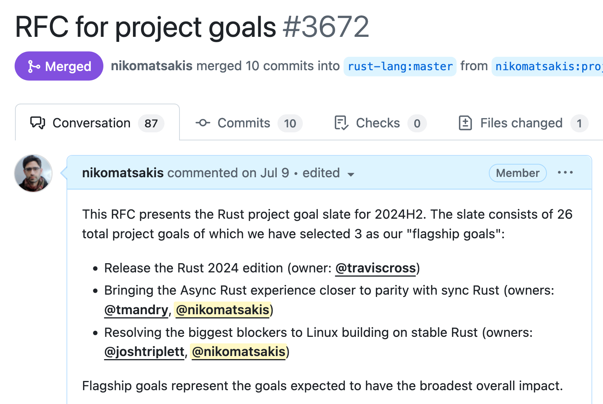
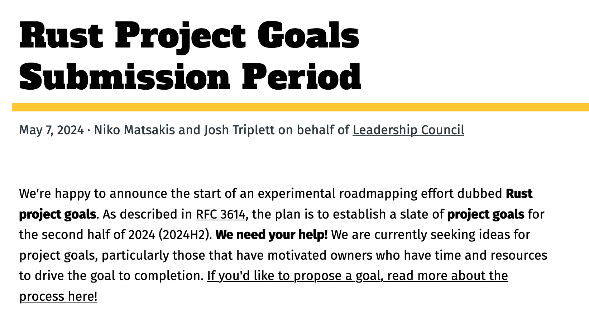
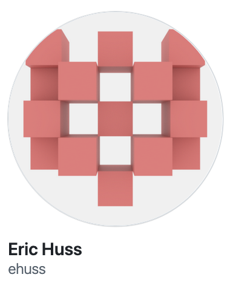

class: center
name: title
count: false

.lobster-regular[.huge[.huge[Rust]]]

.p40[]

.open-sans-light[Revolutionizing<br>Systems Programming<br>Since 2015]

.me[.grey[*by* **Nicholas Matsakis**]]
.left[.citation[View slides at `https://nikomatsakis.github.io/rustconf-2024/`]]

---

# Who is this guy?

.center[.p60[]]

???

Hi, I'm Niko! Been in the project since 2011.

Mostly work on the language design at this point,
but I've been involved in many different things over time.

Lately I've been working on something called Project goals.

---

# Rust Project Goals

.p100[]

???

If you've been following the RFC repo, you may have seen this RFC go by.
It lays out a set of 26 official goals for the remainder of the year.
Of those, 3 of them are designated as flagship goals,
meaning that they are expected to have the broadest impact and interest.
We are going to go through those flagship goals in detail, 
but before we do, I want to talk a bit about the process that led to this RFC.

---

# What are Project Goals?

???

Project goals are an effort to restart the Rust roadmapping process.
Those of you who have been following Rust for a while will remember
we had annual roadmaps for a while, the last one was in 2021.
And I don't know about you, but I've been feeling the gap.
It's harder to follow what's going on and
it's harder to rally the project around a big goal.
and it's harder to get feedback if an idea you're working on has a path into Rust or not.
Project Goals are an effort to get that process up and going again
and to provide a structure that lets us focus our efforts
and better communicate with the outside world about what's happening in Rust.

---

# Begins with a submission period

.p100[]

???

This process works a bit differently.
The old model for roadmaps really wound up being kind of top down.
There was a call for blog posts,
but then some of us got our heads together,
drafted an RFC, and put it out there.
But project goals are more bottom up.

The process begins with a Call for Submissions.
This one was in May, the next will likely be in October
because project goals always over a 6 month period.

The criteria for proposing a goal is that
(1) you have an idea that you'd like to pursue,
and (2) you're willing to put up resources to make that idea happen.

Those resources could be time and effort,
but they could also be expertise and mentorship,
or even financial sponsorship.

In this way project goals embody that old-school open source
philosophy of "scratch your own itch". We know that every project
goal that gets proposed must be important to *somebody* at least,
because somebody is willing to put their time and energy to make it happen.

---
# Project goals as contracts

At heart, a project goal is an agreement between

* The **owner**, who will do the work
* The **Rust teams**, who will support the work

.abspos.left340.top100.huge[.huge[.huge[
🤝🏽
]]]

???

Of course, having somebody willing to do the work doesn't make it a good idea.
And that's why project goals have to be approved by the team.
Ultimately project goals are a kind of agreement.
On the one hand, you have the owner, the person doing the work.
On the other, you have the Rust teams, the ones who maintain Rust.
If the goal is accepted, that is a way for the Rust teams to say
"Yes, we agree this work would be good, and we will support you in doing it"
with clear expectations on both sides.

That support can take many forms.
For example, especially for early ideas,
it might be as simple as "discussion and moral support"--
meaning that the team agrees with the overall direction and, in the future,
would like to incorporate the work if it goes well.
But it could also be something specific,
like "make a decision about the RFC I plan to write within one month".

<!--
//---
//# From contributor to career
//
//???
//
//One interesting aspect of project goals is that,
//for the first time, they provide a way for the project
//to officially say "this is work that is important to Rust
//and which we would like to see get done".
//
//My hope is that this will be helpful to people who are looking
//to do that work as part of their job.
//It's a much easier sell to approach your boss and say
//"you know that feature everybody says would be nice in Rust?
//If I can work 20h a week on it, the project says they'd like to have it".
//
//---
//# A front door for Rust
//
//--
//
//.abspos.left300.top225.huge[
//💡 RFC
//]
//
//--
//
//.abspos.left350.top320.width75px.rotate90[
//
//]
//
//.abspos.left300.top380.huge[
//🔬 Nightly
//]
//
//--
//
//.abspos.left350.top470.width75px.rotate90[
//
//]
//
//.abspos.left300.top530.huge[
//✅ Stable
//]
//--
//
//.abspos.left300.top75.huge[
//👋🏽 Project goal
//]
//
//.abspos.left350.top160.width75px.rotate90[
//
//]
//
//???
//
//My final hope for project goals is that they can evolve to be a kind of "front door" for Rust.
//They are a way for people who have an idea to bring it forward, get feedback.
//And, as the person running the program, I see part of my job as to take
//idaes that might not be ready yet and help them get shaped into something that can be accepted.
-->

---
# Goals chosen

* [26 total goals](https://rust-lang.github.io/rust-project-goals/2024h2/accepted.html)
* 3 of which are [**flagship goals**](https://rust-lang.github.io/rust-project-goals/2024h2/flagship.html)
    * Prepare for Rust 2024 Edition
    * Bring Async Rust and Sync Rust closer to parity
    * Bring Linux Kernel closer to building on stable Rust

???

OK, enough about process, let's talk about the actual goals we ended up with and what they mean for Rust.
As I mentioned earlier, the RFC had 26 total goals, 3 of which were chosen as "flagship goals".
I'm going to go through each of those goals and talk a bit about it and what I think it means for Rust.

---
# Flagship goal #1

## Prepare for Rust 2024 Edition

.abspos.left50.top400[.small[Edition coordinators:]]
.footnote[
.githubavatar[]
.githubavatar[]
]
.abspos.left350.top590[.small[...and more!]]

---

# What is an edition?

---

# One way: Rust "2.0"

.abspos.left125.top125[ <u>Rust 1.x </u> ]

.abspos.left100.top175.width150px[]
.abspos.left145.top350[<code>serde</code>]
.abspos.left150.top400.width50px.rotate270[]
.abspos.left100.top450.width150px[]
.abspos.left120.top625[<code>your-crate</code>]

---

# One way: Rust "2.0"

.abspos.left125.top125[ <u>Rust 1.x </u> ]
.abspos.left525.top125[ <u>Rust 2.x </u> ]

.abspos.left100.top175.width150px[]
.abspos.left145.top350[<code>serde</code>]
.abspos.left150.top400.width50px.rotate270[]
.abspos.left100.top450.width150px[]
.abspos.left120.top625[<code>your-crate</code>]

---

# One way: Rust "2.0"

.abspos.left125.top125[ <u>Rust 1.x </u> ]
.abspos.left525.top125[ <u>Rust 2.x </u> ]

.abspos.left100.top175.width150px[]
.abspos.left145.top350[<code>serde</code>]

.abspos.left350.top400.width100px.rotate200[]
.abspos.left500.top450.width150px[]
.abspos.left520.top625[<code>your-crate</code>]

--

.abspos.left700.top500.fontSize50pt[❌]

---

# Rust way: Editions

.abspos.left125.top125[ <u>Rust 2021</u> ]

.abspos.left100.top175.width150px[]
.abspos.left145.top350[<code>serde</code>]
.abspos.left150.top400.width50px.rotate270[]
.abspos.left100.top450.width150px[]
.abspos.left120.top625[<code>your-crate</code>]

---

# Rust way: Editions

.abspos.left125.top125[ <u>Rust 2021</u> ]
.abspos.left525.top125[ <u>Rust 2024</u> ]

.abspos.left100.top175.width150px[]
.abspos.left145.top350[<code>serde</code>]
.abspos.left150.top400.width50px.rotate270[]
.abspos.left100.top450.width150px[]
.abspos.left120.top625[<code>your-crate</code>]

---

# Rust way: Editions

.abspos.left125.top125[ <u>Rust 2021</u> ]
.abspos.left525.top125[ <u>Rust 2024</u> ]

.abspos.left100.top175.width150px[]
.abspos.left145.top350[<code>serde</code>]

.abspos.left350.top400.width100px.rotate200[]
.abspos.left500.top450.width150px[]
.abspos.left520.top625[<code>your-crate</code>]

--

.abspos.left700.top500.fontSize50pt[✅]

---

# Rust way: Editions

.abspos.left125.top125[ <u>Rust 2021</u> ]
.abspos.left525.top125[ <u>Rust 2024</u> ]

.abspos.left500.top175.width150px[]
.abspos.left545.top350[<code>serde</code>]

.abspos.left350.top350.width100px.rotate340[]
.abspos.left100.top450.width150px[]
.abspos.left120.top625[<code>your-crate</code>]

.abspos.left300.top500.fontSize50pt[✅]

---

# But wait, there's more!

```rust
cargo fix --edition
```

Read the [Edition Guide](https://doc.rust-lang.org/nightly/edition-guide/index.html) for more!

---

# What are we actually changing?

```rust
fn process_data(
    datums: &[Datum]
) -> impl Iterator<Item = ProcessedDatum> {
    datums
        .iter()
        .map(|datum| datum.process())
}
```

[Playground.](https://play.rust-lang.org/?version=stable&mode=debug&edition=2021&gist=1d29341a7d1970e29a9e7b87c9136629)

---

# Inconsistent

```rust
async fn process_data(input: &Input) -> Result
```

--

we say that desugars to...

```rust
fn process_data(
    input: &Input,
) -> impl Future<Output = Result>
```

---

# True desugaring

```rust
async fn process_data(input: &Input) -> Result
```

...but in reality it's more like...

```rust
fn process_data(
    input: &Input,
) -> impl Future<Output = Result> + '_
```

.abspos.left390.top170[
.red[<sup>*</sup>]
]

.footnote[
.red[<sup>*</sup>] In fact, if there are multiple generic parameters,
this desugaring is also wrong. In that case, the true
desugaring can't be readily expressed in Rust 2021
(it can in Rust 2024).
]

---

# What about Rust 2024?

Well, let's try it!

[Playground.](https://play.rust-lang.org/?version=stable&mode=debug&edition=2021&gist=1d29341a7d1970e29a9e7b87c9136629)

---
# What does the Rust 2024 goal say about Rust?

--

.lobster-regular.huge.red[We are not done.]

???

So, what does it say when we make Rust 2024 one of our goals?

I think it's simple: we are not done making Rust better.

Rust has had a tremendous couple of years.
Rust usage has grown very fast and it's in use in companies big and small.
It runs a big part of the internet.
You could take from that, hey, Rust is good, we can stop working on it.
In my view, that shows Rust's potential.
And if we truly want to live up to that potential, 
we have to press on and keep looking for ways to simplify Rust,
sanding off the edges,
improving ergonomics,
without losing what makes it great.

That's why I love editions -- they give us a tool to make gradual change without disrupting the existing ecosystem.

---

# Flagship goal #2

## Bring Async Rust and Sync Rust closer to parity

.abspos.left50.top400[.small[People working on design and development for this goal:]]
.footnote[
.githubavatar[]
.githubavatar[]
.githubavatar[]
.githubavatar[]
]
.abspos.left650.top590[.small[...and more!]]

???

Let's look at our second goal, which concerns "async Rust".

---

# Networking and Rust...

...are like peanut butter and chocolate!

...or vanilla ice cream and rainbow sprinkles!

...or, uh, two other things you like together!

.center[
.p40[]
]

???

Async Rust is a very popular application area for Rust.
52% of respondents to the Rust survey said they were using async Rust in some way.

---
# Why?

* Tail latency

???

So, why is Rust so popular for networking?
There are a few big reasons.
The first is tail latency.
Because Rust programs do not require a garbage collector,
they do not suffer from GC pauses.
Plus Rust's overall design generally leads to predictably high performance.
Especially for at-scale data planes,
tail latency often controls scaling and cost.

---
# Why?

* Tail latency
* Startup time + memory usage

???

Of course, not everybody is building high-scale data planes.
Rust is also a very popular choice for building "Single Shot" functions,
like Lambdas or Azure Functions.
Why? Well, it doesn't have a runtime, so it starts up super quick,
and it doesn't use much memory,
which helps control costs.

---
# Why?

* Tail latency
* Startup time + memory usage
* Reliability

???

The final factor though is one that is often overlooked: reliability.
Network services often run 24/7, and so you want to catch every bug you can as early as you can
so you don't get paged while you're in a movie.
Rust's type system not only guarantees memory safety, it rules out a lot of other common bugs too.
There are no null pointer exceptions in Rust, and you can't forget to take the lock on your shared data.
What's more, you can often model your application domain in Rust, so you can catch domain-specific bugs too,
like forgetting to convert from US dollars to Canadian dollars.

---

# The problem

> Async Rust is Rust on hard mode.<br>
> <br>
> &mdash; Amazon employee (2019 or so)

.center[
.p40[]
]

.abspos.left350.top535.homey[
*Mmm, hard mode.*
]

???

So what's the problem? Well, Rust's support for async-await remains incomplete.
Using Async Rust means you have to learn about these limitations and learn how to work around them.

---
name:basic-idea
# Basic idea is simple

```rust
async fn load_data() -> Data { ... }

async fn process_request() {
    let data = load_data().await;
    ...
}
```

---
template:basic-idea

???

Now, why is it so hard?
I mean, the basic idea of async-await is pretty simple.
You've probably seen it in other languages.

---
template:basic-idea

.abspos.left100.top100.rotate135.width50px[]

When a function might make network requests, you tag it with `async`.

---
template:basic-idea

.abspos.left370.top175.rotate135.width50px[]

???

When you call that function, you add a `.await` at the end
to actually do the request and get the data.

---
# But there's lots of details

* [x] **Inherent and top-level functions**
* [x] **Async fn in traits** (stabilized 2023)
* [ ] **Async closures** (planned for 2024)
* [ ] Async in `Drop`
* [ ] Async versions of common traits (`Read`, `Write`, `Iterator`)
* [ ] Async version of "scoped threads"

???

Unfortunately, in Rust today, async functions are only supported
in a narrow range of the places you might want.
It turns out that making these things work is actually really complicated.
We're working on knocking them off and extending support.
Last year we added support for async fn in traits,
and this year we plan to stabilize support for async closures.

---
name:syncfn

# Async closures

```rust
fn for_each_prime(execute: impl Fn(u32)) {
    execute(2);
    execute(3);
    execute(5);
    // ...
}

for_each_prime(|x| process(x)));
```

???

So what are async closures? Well, you probably know regular closures.

---
template:syncfn

.abspos.left400.top100.rotate135.width50px[]

---
template:syncfn

.abspos.left230.top300.rotate135.width50px[]

---
name:asyncfn

# Async closures

```rust
async fn for_each_prime(execute: &impl async Fn(u32)) {
    execute(2).await;
    execute(3).await;
    execute(5).await;
    // ...
}

for_each_prime(async |x| process(x).await)).await;
```

.abspos.left305.top5[
.red[<sup>*</sup>]
]

.footnote[.red[<sup>*</sup>] Syntax subject to change.
[We are seeking feedback! Try it out!](https://blog.rust-lang.org/inside-rust/2024/08/09/async-closures-call-for-testing.html)]

---
template:asyncfn

.abspos.left100.top100.rotate135.width50px[]

---
template:asyncfn

.abspos.left495.top100.rotate135.width50px[]

---
template:asyncfn

.abspos.left255.top177.rotate215.width50px[]

---
template:asyncfn

.abspos.left255.top300.rotate135.width50px[]

---
template:asyncfn

.abspos.left450.top300.rotate135.width50px[]

---
# What does the Async Rust goal say about Rust?

--

.lobster-regular.huge.red[Fearless concurrency.]

???

I see the async goal as a continuation of
Rust's commitment to fearless concurrency --
the ability to write programs with complex schedules that,
you know, actually work.

Async is a great example of the power of Rust,
where you get to write code that looks really high-level and familiar,
but compiles down to something very efficient.

Concurrency and parallelism are the key to scaling up
and solving the biggest engineering challenges,
and that's where Rust will continue to focus a lot of energy
going forward.

---

# Flagship goal #3

## Bring Linux Kernel closer to building on stable Rust

.abspos.left50.top400[.small[People working on development for this goal:]]
.footnote[
.githubavatar[]
.githubavatar[]
.githubavatar[]
.githubavatar[]
.githubavatar[]
]
.abspos.left800.top590[.small[...and more!]]

---
# Promise

Low-level but safe

---
# Challenge

Lots of unstable features.

Makes it hard to sell Rust.

---
# What does the "Rust-for-Linux" goal say about Rust?

--

.lobster-regular.huge.red[No limits.]

???

One of Rust's selling points is that you can go as deep as you want to go.
The goal is ultimately to expose every capability of the system.

But I think there's another inspiring part of the work on Rust for Linux.
I believe in my heart that as the Rust For Linux work
proceeds we are going to see a revolution in the accessibility
of the linux kernel.

What I think is most interesting about Rust is the way that it makes systems and low-level programming more productive and hence more accessible.

Think of the words we usually use -- we say that people are systems programming wizards. The way I see it, systems programming typically requires a lot of specific, rather arcane knowledge. It's not that other people couldn't acquire that knowledge. It's that it doesn't make sense to prioritize it when there are so many other things to work on.

But Rust adds guardrails that lets you gradually go deeper, avoiding the worst mistakes, and getting wins along the way.

---
# Rust-for-Linux contributors

* Miguel Ojeda
* Alex Gaynor
* Wedson Almeida Filho
* Boqun Feng
* Gary Guo
* Björn Roy Baron
* Benno Lossin
* Andreas Hindborg
* Alice Ryhl
* Trevor Gross

.abspos.left550.top200[.huge[.huge[.huge[🤘]]]]
.abspos.left550.top450[.huge[.lobster-regular[Y'all rock]]]

???

Before I finish up here, let me just give a big shout out
to all the people who've worked on Rust-for-Linux.
This is some seriously cool stuff.

---
# Project goal updates

First update post coming next week! .red[<sup>*</sup>]<br>
Stay tuned to the blog!

.center[
.p40[]
]

.abspos.left370.top470.homey[
*Mmm, blog.* .red[<sup>†</sup>]
]

.footnote[
.red[<sup>*</sup>] Epp! 😨 Now I'm committed!<br>
.red[<sup>†</sup>] I couldn't stop myself. Last Homer gif, I SWEAR. 🤞<br>
]

---

# Rust keeps getting better

* Ever simpler
* Fearless concurrency
* No limits

