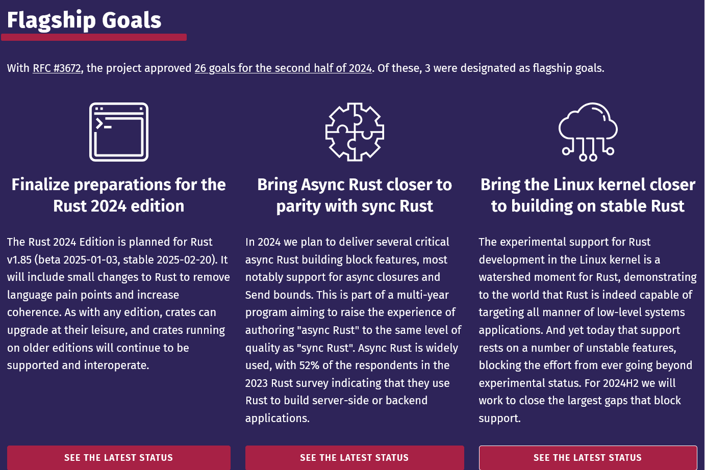
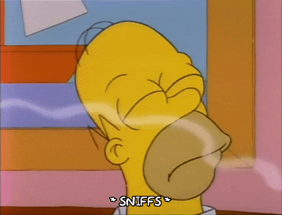

class: center
name: title
count: false

# Rust Project Goals

.p60[]

.me[.grey[*by* **Nicholas Matsakis**]]
.left[.citation[View slides at `https://nikomatsakis.github.io/rustconf-2024/`]]

---

# Who is this guy?

???

Hi, I'm Niko!

---

# Rust Project Goals

.p100[]

---

# Why I started working on Rust...

### Type safe sytems programming?!

---

---

## Open source?!

---

dancing.gif

---

# Open source

From the Rust Code of Conduct...

> Respect that people have differences of opinion and that **every design or implementation choice carries a trade-off and numerous costs**. There is seldom a right answer. *(emphasis mine)*

---
name:scratching

# Open source strengths

* Scratching your own itch

---

# Scratching your own itch

---
template:scratching

---
template:scratching
name:empowering

* Empowering individuals

---

# Empowering individuals

---
template:empowering

---
template:empowering
name:diversity

* Diversity of opinion

---

# Diversity of opinion

---
name:following-along

# Open source challenges

* .red[.strikeme[Scratching your own itch] ⟿]
    * Hard to get organized

---
template:following-along
name:sustainability

* .red[.strikeme[Empowering individuals] ⟿]
    * Group outreach is hard

---
template:sustainability
name:decisions

* .red[.strikeme[Diversity of opinion] ⟿]
    * Reaching decisions

---

# The goals

* Finalize preparations for the Rust 2024 edition 
* Bring Async Rust closer to parity with sync Rust 
* Bring the Linux kernel closer to building on stable Rust 

---

# Rust 2024 edition