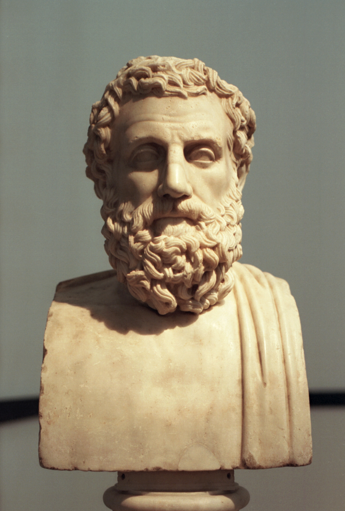

class: center
name: title
count: false

# Rust Project Goals

.p60[]

.me[.grey[*by* **Nicholas Matsakis**]]
.left[.citation[View slides at `https://nikomatsakis.github.io/rustconf-2024/`]]

---

# Who is this guy?

.center[.p60[]]

???

Hi, I'm Niko! Been in the project since 2011.

Mostly work on the language design at this point,
but I've been involved in many different things over time.

Lately I've been working on something called Project goals.

This effort is taking aim at something that is very hard in open source: planning.

<!--
//---
//
//.abspos.left275.top75[
//### Open source's greatest strengths
//]
//
//???
//
//If you've been involved with open source, you know that there's an awful lot to love.
//It's so cool the way people can show up with a great idea, get to work, and make a difference.
//
//--
//
//.abspos.left200.top300[
//# ARE ITS GREATEST WEAKNESSES
//]
//
//.abspos.left650.top400.width150px[]
//
//.abspos.left375.top475[
//.speech-bubble.barbara.right[
//    Sounds familiar.
//]
//]
//
//.abspos.left670.top600.width150px[.white[Aeschylus]]
//
//.footnote[Image by Zde - Own work, CC BY-SA 4.0, [source](https://commons.wikimedia.org/w/index.php?curid=68366219)]
-->

---

# Rust Project Goals

.p100[]

???

If you've been following the RFC repo, you may have seen this RFC go by.
It lays out a set of 26 official goals for the remainder of the year.
Of those, 3 of them are designated as flagship goals,
meaning that they are expected to have the broadest impact and interest.
We are going to go through those flagship goals in detail, 
but before we do, I want to talk a bit about the process that led to this RFC.

---

# What are Project Goals?

???

If you've been involved in the project for a while,
you may remember that we used to issue Roadmap RFCs.
The last one was in 2021, and in the time since, we've begun to feel the gap.
It's become harder to know what other people are doing,
and there's a sense that everyone is off doing their own thing,
instead of people pulling in a coordinated direction.

I want to be clear. People "doing their own thing" is not bad.
That is in fact the magic of open source.

But to be effective, 
and to have the project be accessible to everyone,
you also need some degree of coordination.

Project goals are intended to be a process
that can help us rally around common goals
while also encouraging individual contributors
who have a great idea they want to pursue.

---

# What are Project Goals?

.p100[]

???

The process begins with a call for submissions. 

This is an open call, meant to be answered both by anyone who has an idea they would like to see happen in Rust.

Well, not quite that broad. It's not enough to have an idea.
You also have to have **resources** you are willing to put forward to make that idea happen.

For most, this resource will be time and effort -- e.g., I would like to work on this.
Or perhaps I have a team of people who want to work on this.

For experienced Rust developers, it's sometimes a bit different. I would like to mentor someone to work on this,
but I'm still looking for the right person. 

It could even be a company saying they'd like to fund someone to work on this because it's something they need.

---
# Project goal components

At its heart, a project goal has three main pieces

* Motivation
* Next steps
* Team asks

---
# Motivation

What problem are you trying to solve?

???

In some sense, a project goal can be seen as the "first half" of an RFC.
Where an RFC asks for general review of a finished design,
a project goal is laying out the work you plan to do over the next 6 months.
Therefore, it focuses on the motivation: what problem do you want to attack,
and how do you (roughly) plan to do it?

This problem doesn't have to be a language feature.
It could be an issue with Rust's infrastructure,
or with the maintainability of a common library or tool.
It could even be a social problem.
(In fact, I submitted a goal for running the goals process itself!)

---
# Next steps

What will you do over the next 6 months?

???

The goal also lays out what specifically you plan to do over the next 6 months.

Goals are intentionally scoped down to 6 months because that's a time frame where we can reasonably predict what wil happen.

It's also meant to encourage us to think iteratively:
often we have a big problem we want to solve,
but the only way to do that is to work step by step.

---
# Team asks

What support do you need from the Rust teams?

???

Finally, goals include asks of the Rust teams.
A Rust "team" is the set of people who maintain a given part of Rust.
For example, I'm part of the language design team
but there's a separate team that makes decisions about the compiler architecture.
There are also team for managing Rust's infrastructure and releases,
the standard library, etc.

A common misunderstanding about teams is that they are the ones who "implement" Rust.
In my mind, the role of a team in open source is not to DO the work,
it is to REVIEW the work.

Sure, people on teams may implement features, but when they do that,
they are acting as a contributor.
Or, as I like to call it, an OWNER.
The person who reviews that work, they are acting as a team member.

A project goal then is a kind of contract between the OWNER,
the one doing the work,
and the TEAM that is supporting it.

The OWNER says "I will put up resources, time, expertise, whatever",
but if I do that, I need this support from the team.

Sometime that support is as little as what we call "Discussion and moral support" --
that is, I need you to say that you approve of this direction,
and might ultimately be interested in incorporating this work.
Othertimes it's very specific, like "I need 2 design meetings with the team"
or "I need you to make a prompt decision about the RFC I plan to write".

<!--
//---
//# From contributor to career
//
//???
//
//I want to take a moment to talk about another goal of the RFC process,
//which is helping people to get paid to work on Rust.
//
//This is a tricky topic that deserves a lot of nuance.
//Money is not the panacea to avoiding burnout or making open-source sustainable.
//But at the same time, for a lot of people, money is the blocker to contributing to Rust full time.
//
//Project goals are not themselves connected to income.
//But they provide a way for people to s
-->

---
# Goals chosen

* 26 total goals
* 3 of which are **flagship goals**
    * Prepare for Rust 2024 Edition
    * Bring Async Rust and Sync Rust closer to parity
    * Bring Linux Kernel closer to building on stable Rust

---
# Flagship goal #1

## Prepare for Rust 2024 Edition

---

# What is an edition?

---

# One way: Rust "2.0"

.abspos.left125.top125[ <u>Rust 1.x </u> ]

.abspos.left100.top175.width150px[]
.abspos.left145.top350[<code>serde</code>]
.abspos.left150.top400.width50px.rotate270[]
.abspos.left100.top450.width150px[]
.abspos.left120.top625[<code>your-crate</code>]

---

# One way: Rust "2.0"

.abspos.left125.top125[ <u>Rust 1.x </u> ]
.abspos.left525.top125[ <u>Rust 2.x </u> ]

.abspos.left100.top175.width150px[]
.abspos.left145.top350[<code>serde</code>]

.abspos.left350.top400.width100px.rotate200[]
.abspos.left500.top450.width150px[]
.abspos.left520.top625[<code>your-crate</code>]

--

.abspos.left700.top500.fontSize50pt[❌]

---

# Rust way: Editions

.abspos.left125.top125[ <u>Rust 2021</u> ]

.abspos.left100.top175.width150px[]
.abspos.left145.top350[<code>serde</code>]
.abspos.left150.top400.width50px.rotate270[]
.abspos.left100.top450.width150px[]
.abspos.left120.top625[<code>your-crate</code>]

---

# Rust way: Editions

.abspos.left125.top125[ <u>Rust 2021</u> ]
.abspos.left525.top125[ <u>Rust 2024</u> ]

.abspos.left100.top175.width150px[]
.abspos.left145.top350[<code>serde</code>]

.abspos.left350.top400.width100px.rotate200[]
.abspos.left500.top450.width150px[]
.abspos.left520.top625[<code>your-crate</code>]

--

.abspos.left700.top500.fontSize50pt[✅]

---

# Rust way: Editions

.abspos.left125.top125[ <u>Rust 2021</u> ]
.abspos.left525.top125[ <u>Rust 2024</u> ]

.abspos.left500.top175.width150px[]
.abspos.left545.top350[<code>serde</code>]

.abspos.left350.top350.width100px.rotate340[]
.abspos.left100.top450.width150px[]
.abspos.left120.top625[<code>your-crate</code>]

.abspos.left300.top500.fontSize50pt[✅]

---

# What are we actually changing?

```rust
fn process_data(
    datums: &[Datum]
) -> impl Iterator<Item = ProcessedDatum> {
    datums
        .iter()
        .map(|datum| datum.process())
}
```

[Playground.](https://play.rust-lang.org/?version=stable&mode=debug&edition=2021&gist=89418b7fe6748de2c4a335c7d529daa8)

---

# Inconsistent

```rust
async fn process_data(input: &Input) -> Result
```

--

we say that desugars to...

```rust
fn process_data(
    input: &Input,
) -> impl Future<Output = Result>
```

---

# True desugaring

```rust
async fn process_data(input: &Input) -> Result
```

...but in reality it's more like...

```rust
fn process_data(
    input: &Input,
) -> impl Future<Output = Result> + '_
```

.footnote[
    In fact, if there are multiple lifetime parameters,
    this desugaring is also wrong. In that case, the true
    desugaring can't be readily expressed in Rust 2021
    (it can in Rust 2024).
]

---

# What about Rust 2024?

Well, let's try it!

[Playground.](https://play.rust-lang.org/?version=stable&mode=debug&edition=2021&gist=89418b7fe6748de2c4a335c7d529daa8)

---
# What does the Rust 2024 goal say about the Rust project?

--

We are not done.

???

So, what does it say when we make Rust 2024 one of our goals?

I think it's simple: we are not done.

Rust has had a tremendous couple of years.
Rust usage has grown very fast and it's in use in companies big and small.

There are two ways to respond to success like this.

One is to take it as a sign that the language is fine "as is", that things seem to be working.
And that is true.

But I think it's also a sign of how much potential Rust has to empower people to build new and better things.
And if we truly want to live up to that potential, I think we have to press on with making improvements,
working to sand off the edges, improve ergonomics, and to simplify the language without losing what makes it great.

That's why I love editions -- they give us a tool to make gradual change without disrupting the existing ecosystem.

---

# Flagship goal #2

## Bring Async Rust and Sync Rust closer to parity

???

Let's look at our second goal, which concerns "async Rust".

---

# Networking and Rust...

...are like peanut butter and chocolate!

...or vanilla ice cream and rainbow sprinkles!

...or, uh, two other things you like together!

.center[
.p40[]
]

???

Async Rust is a very popular application area for Rust.
52% of respondents to the Rust survey said they were using async Rust in some way.

---
# Why?

* Tail latency

???

So, why is Rust so popular for networking?
There are a few big reasons.
The first is tail latency.
Because Rust programs do not require a garbage collector,
they do not suffer from GC pauses.
Plus Rust's overall design generally leads to predictably high performance.
Especially for at-scale data planes,
tail latency often controls scaling and cost.

---
# Why?

* Tail latency
* Startup time + low memory usage

???

Of course, not everybody is building high-scale data planes.
Rust is also a very popular choice for building "Single Shot" functions,
like Lambdas or Azure Functions.
Why? Well, it doesn't have a runtime, so it starts up super quick,
and it doesn't use much memory,
which helps control costs.

---
# Why?

* Tail latency
* Startup time + memory usage
* Reliability

???

The final factor though is one that is often overlooked: reliability.
Network services often run 24/7, and so you want to catch every bug you can as early as you can.
Rust's type system not only guarantees memory safety, it rules out a lot of other common bugs too.
There are no null pointer exceptions in Rust, and you can't forget to take the lock on your shared data.
What's more, you can often model your application domain in Rust, so you can catch domain-specific bugs too,
like forgetting to convert from euros to pounds.

---

# The problem

> Async Rust is Rust on hard mode.<br>
> <br>
> &mdash; Amazon employee (2019 or so)

???

So what's the problem? Well, Rust's support for async-await remains incomplete.
Using Async Rust means you have to learn about these limitations and learn how to work around them.

---
# Bring Async Rust and Sync Rust closer to parity

```rust
async fn load_data() -> Data { ... }

async fn process_request() {
    let data = load_data().await;
    ...
}
```

---
# Plenty of gaps

* [x] Inherent and top-level functions
* [x] Async fn in traits (stabilized 2023)
* [ ] Async closures (planned for 2024)
* [ ] Async in `Drop`
* [ ] Async versions of common traits (`Read`, `Write`, `Iterator`)
* [ ] Async version of "scoped threads"

---
# What does the Async Rust goal say about the Rust project?

--

<i>Fearless concurrency.</i>

???

Rust remains 

---

# Flagship goal #3

## Bring Linux Kernel closer to building on stable Rust

---
# What does the "Rust-for-Linux" goal say about the Rust project?

<i>No limits.</i>